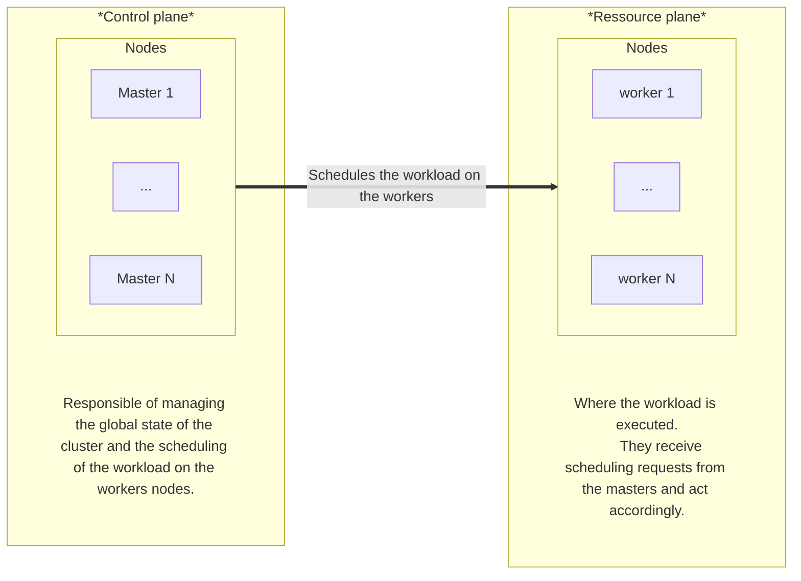

## Kubernetes cluster architecture

Each Kubernetes cluster is composed of multiple nodes grouped in 2 categories:
- *Control plane*, or *master*, nodes
- *Ressource plane*, or *worker*, nodes



Each node is composed of various components, based on its role in the cluster:

- Master nodes:
  - `kube-apiserver`: The core component server that exposes the Kubernetes HTTP API.
  - `etcd`: Consistent and highly-available key value store for all API server data.
  - `kube-scheduler`: Looks for Pods not yet bound to a node, and assigns each Pod to a suitable node.
  - `kube-controller-manager`: Runs controllers to implement Kubernetes API behavior.
- Worker nodes:
  - `kubelet`: Ensures that Pods are running, including their containers.
  - `Container runtime`: Software responsible for running containers. Can be containerd, CRI-O or any runtime compatible with the [*Container Runtime Interface*](https://kubernetes.io/docs/concepts/containers/cri/).

The master and worker nodes can include other components to add additional features:
- Cluster networking through a [network plugin](https://kubernetes.io/docs/concepts/extend-kubernetes/compute-storage-net/network-plugins/), such as the builtin [`kube-proxy`](https://kubernetes.io/docs/reference/command-line-tools-reference/kube-proxy/), [Cillium](https://docs.cilium.io/en/stable/network/kubernetes/kubeproxy-free/)...
- [Advanced persistent storage](https://kubernetes.io/docs/concepts/storage/volumes/#csi)
- [Internal DNS resolving](https://kubernetes.io/docs/concepts/services-networking/dns-pod-service/)


[\[src\]](https://kubernetes.io/docs/concepts/architecture)

### About the controllers

The controllers are core components of a cluster and have the role of reconciling the current state of the resource(s) they manage with the disered target state (usually defined in the manifests provided by the user).

They are based on an infinite control loop : *observe - compare - reconcile*.

The `kube-controller-manager` comes with builtin controllers to manage the standard kubernetes resources: *Deployments*, *StatefulSet*, *ConfigMaps*, *Secrets*, *Jobs*...

[\[src\]](https://kubernetes.io/docs/concepts/architecture/controller/)

## Kubernetes base resources

<!-- Pod, Deployment, Replicaset, Statefulset, Configmap, Secrets, Service, Ingress, DaemonSet, Jobs, CronJobs, Service accounts -->

### Namespace

### Pod

The *pod* is the smallest unit of workload that can be managed. They are composed of one or more containers that run on one given node.

In most cases a pod is created by a parent resource, such as a *Deployment*, or a *StatefulSet*.

#### Init and sidecar container

#### Probes

#### Scheduling constraints

<!-- antiaffinity, topology spread constraints -->

### ReplicatSet

A *ReplicaSet*'s purpose is to maintain a stable set of replica *Pods* running at any given time.

Usually, you define a *Deployment* and let that *Deployment* manage *ReplicaSets* automatically.

A ReplicaSet is defined with fields, including:
- a selector that specifies how to identify Pods it can acquire,
- a number of replicas indicating how many Pods it should be maintaining,
- a pod template specifying the data of new Pods it should create to meet the number of replicas criteria.

<details>
<summary>Example</summary>

```yaml
apiVersion: apps/v1
kind: ReplicaSet
metadata:
  name: frontend
  labels:
    app: guestbook
    tier: frontend
spec:
  replicas: 3
  selector:
    matchLabels:
      tier: frontend
  template:
    metadata:
      labels:
        tier: frontend
    spec:
      containers:
      - name: php-redis
        image: us-docker.pkg.dev/google-samples/containers/gke/gb-frontend:v5
```
</details>

[\[src\]](https://kubernetes.io/docs/concepts/workloads/controllers/replicaset/)

### Deployment

A Deployment manages a set of Pods to run an application workload, usually one that doesn't maintain state.

<details>
<summary>Example</summary>

```yaml
apiVersion: apps/v1
kind: Deployment
metadata:
  name: nginx-deployment
  labels:
    app: nginx
spec:
  replicas: 3
  selector:
    matchLabels:
      app: nginx
  template:
    metadata:
      labels:
        app: nginx
    spec:
      containers:
      - name: nginx
        image: nginx:1.14.2
        ports:
        - containerPort: 80
```
</details>

[\[src\]](https://kubernetes.io/docs/concepts/workloads/controllers/deployment/)

#### Updating a deployment: rollout, rolling back, scaling

### StatefulSet

A *StatefulSet* runs a group of *Pods*, and maintains a sticky identity for each of those *Pods*. This is useful for managing applications that need persistent storage or a stable, unique network identity.

### DaemonSet

A *DaemonSet* ensures that all (or some) Nodes run a copy of a *Pod*. As nodes are added to the cluster, *Pods* are added to them. As nodes are removed from the cluster, those *Pods* are garbage collected. Deleting a *DaemonSet* will clean up the *Pods* it created.

<details>
<summary>Example</summary>

```yaml
apiVersion: apps/v1
kind: DaemonSet
metadata:
  name: fluentd-elasticsearch
  namespace: kube-system
  labels:
    k8s-app: fluentd-logging
spec:
  selector:
    matchLabels:
      name: fluentd-elasticsearch
  template:
    metadata:
      labels:
        name: fluentd-elasticsearch
    spec:
      tolerations:
      # these tolerations are to have the daemonset runnable on control plane nodes
      - key: node-role.kubernetes.io/control-plane
        operator: Exists
        effect: NoSchedule
      - key: node-role.kubernetes.io/master
        operator: Exists
        effect: NoSchedule
      containers:
      - name: fluentd-elasticsearch
        image: quay.io/fluentd_elasticsearch/fluentd:v5.0.1
        resources:
          limits:
            memory: 200Mi
          requests:
            cpu: 100m
            memory: 200Mi
        volumeMounts:
        - name: varlog
          mountPath: /var/log
      # it may be desirable to set a high priority class to ensure that a DaemonSet Pod
      # preempts running Pods
      # priorityClassName: important
      terminationGracePeriodSeconds: 30
      volumes:
      - name: varlog
        hostPath:
          path: /var/log
```
</details>

[\[src\]](https://kubernetes.io/docs/concepts/workloads/controllers/daemonset/)

### Jobs and CronJobs

A *Job* creates one or more *Pods* and will continue to retry execution of the *Pods* until a specified number of them successfully terminate. As *pods* successfully complete, the *Job* tracks the successful completions. When a specified number of successful completions is reached, the task (ie, *Job*) is complete.

<details>
<summary>Example</summary>

```yaml
apiVersion: batch/v1
kind: Job
metadata:
  name: pi
spec:
  template:
    spec:
      containers:
      - name: pi
        image: perl:5.34.0
        command: ["perl",  "-Mbignum=bpi", "-wle", "print bpi(2000)"]
      restartPolicy: Never
  backoffLimit: 4
```
</details>

[\[src\]](https://kubernetes.io/docs/concepts/workloads/controllers/job/)

A *CronJob* creates *Jobs* on a repeating schedule.

*CronJob* is meant for performing regular scheduled actions such as backups, report generation, and so on. One *CronJob* object is like one line of a crontab (cron table) file on a Unix system. It runs a *Job* periodically on a given schedule, written in Cron format.

<details>
<summary>Example</summary>

```yaml
apiVersion: batch/v1
kind: CronJob
metadata:
  name: hello
spec:
  schedule: "* * * * *"
  jobTemplate:
    spec:
      template:
        spec:
          containers:
          - name: hello
            image: busybox:1.28
            imagePullPolicy: IfNotPresent
            command:
            - /bin/sh
            - -c
            - date; echo Hello from the Kubernetes cluster
          restartPolicy: OnFailure
```
</details>

[\[src\]](https://kubernetes.io/docs/concepts/workloads/controllers/cron-jobs/)

### Configmap and Secrets

A *ConfigMap* is an API object used to store non-confidential data in key-value pairs. *Pods* can consume *ConfigMaps* as environment variables, command-line arguments, or as configuration files in a volume.

<details>
<summary>Example</summary>

```yaml
apiVersion: v1
kind: ConfigMap
metadata:
  name: game-demo
data:
  # property-like keys; each key maps to a simple value
  player_initial_lives: "3"
  ui_properties_file_name: "user-interface.properties"

  # file-like keys
  game.properties: |
    enemy.types=aliens,monsters
    player.maximum-lives=5
  user-interface.properties: |
    color.good=purple
    color.bad=yellow
    allow.textmode=true
```
</details>

[\[src\]](https://kubernetes.io/docs/concepts/configuration/configmap/)

A *Secret* is an object that contains a small amount of sensitive data such as a password, a token, or a key. Such information might otherwise be put in a *Pod* specification or in a container image. Using a *Secret* means that you don't need to include confidential data in the application code.

Secrets are similar to ConfigMaps but are specifically intended to hold confidential data.

<details>
<summary>Example</summary>

```yaml
apiVersion: v1
kind: Secret
metadata:
  name: dotfile-secret
data:
  .secret-file: dmFsdWUtMg0KDQo=
---
apiVersion: v1
kind: Pod
metadata:
  name: secret-dotfiles-pod
spec:
  volumes:
    - name: secret-volume
      secret:
        secretName: dotfile-secret
  containers:
    - name: dotfile-test-container
      image: registry.k8s.io/busybox
      command:
        - ls
        - "-l"
        - "/etc/secret-volume"
      volumeMounts:
        - name: secret-volume
          readOnly: true
          mountPath: "/etc/secret-volume"
```
</details>

[\[src\]](https://kubernetes.io/docs/concepts/configuration/secret/)

### Service

### Ingress
