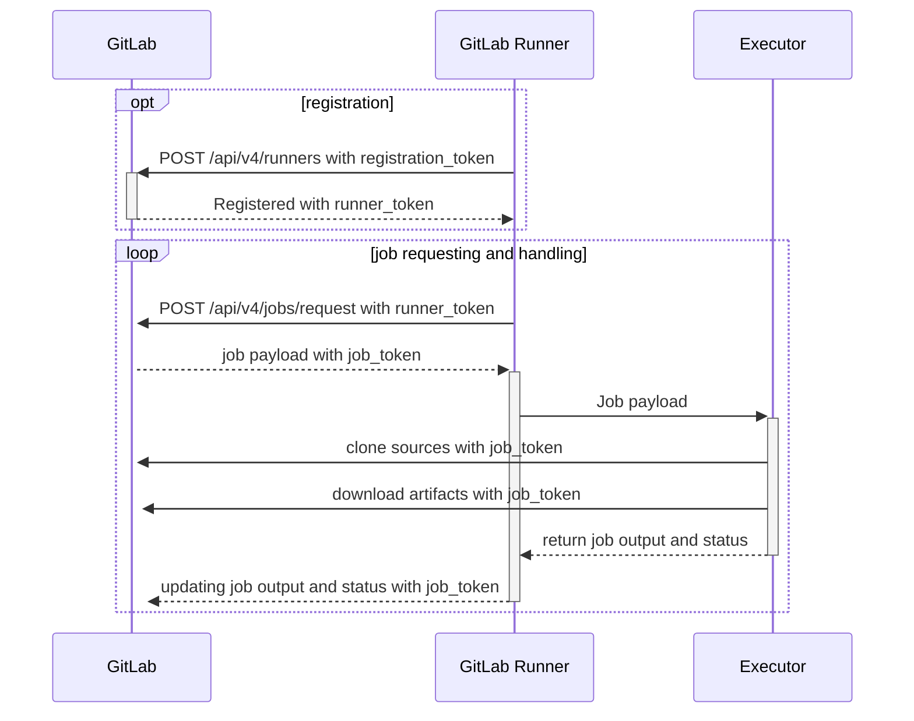

#GitlabCI

https://docs.gitlab.com/runner/

Runner : 

## SaaS vs self-hosted
https://docs.gitlab.com/ee/ci/runners/

## Scope of runners
https://docs.gitlab.com/ee/ci/runners/runners_scope.html
-   Shared runners are available to all groups and projects in a GitLab instance.
-   Group runners are available to all projects and subgroups in a group.
-   Project runners are associated with specific projects. Typically, project runners are used by one project at a time.

## Compatibility
https://docs.gitlab.com/runner/executors/#compatibility-chart

## Runner execution flow

[\[source\]](https://docs.gitlab.com/runner/#runner-execution-flow)

## Démos
Lancer un job et faire un `docker ps`/`ps -faux` en parallèle